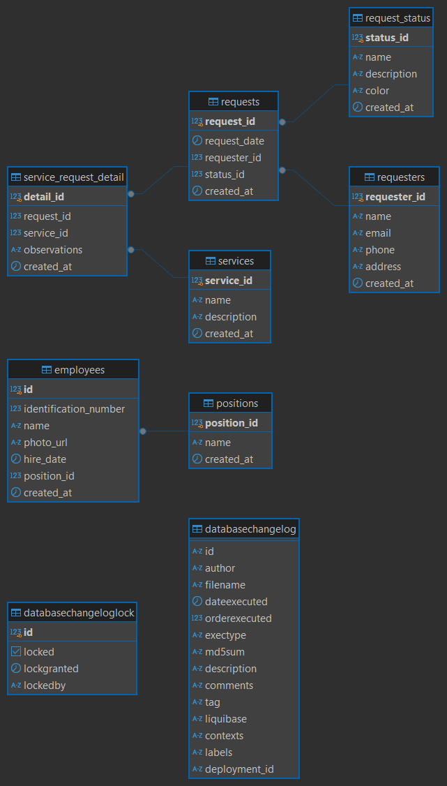

# Employee Service - Sistema de Gestión de Empleados y Solicitudes

Este proyecto es un monorepo que incluye una aplicación de gestión de empleados y solicitudes de servicio, desarrollada con Angular 19 en el frontend, Spring Boot (Java) en el backend y PostgreSQL como base de datos.

## Estructura del Proyecto

```
employee-service-monorepo/
├── frontend/                 # Aplicación Angular 19
├── backend/                  # Aplicación Spring Boot
├── infra/                    # Infraestructura como código
│   ├── terraform/            # Configuración de AWS con Terraform
│   └── database/             # Scripts de base de datos con Liquibase
├── lambda/                   # Funciones Lambda para AWS
│   ├── common/               # Código compartido entre lambdas
│   ├── presigned-url/        # Lambda para generar URLs prefirmadas
│   └── file-retriever/       # Lambda para recuperar archivos
└── docs/                     # Documentación
```

## Modelo Entidad-Relación (MER)

El diseño de la base de datos sigue el Modelo Entidad-Relación (MER) que se encuentra en el archivo `documentation/castordb-mer.png`. Este modelo proporciona una visión general de las entidades principales y sus relaciones.



## Colección de Postman

Para facilitar las pruebas de las APIs del proyecto, se incluye una colección de Postman en el archivo `documentation/EvaluationCastor.postman_collection.json`. Esta colección contiene ejemplos de solicitudes para los diferentes endpoints disponibles en el backend.

Puedes importar esta colección en Postman siguiendo estos pasos:

1. Abre Postman.
2. Haz clic en "Importar" en la esquina superior izquierda.
3. Selecciona el archivo `documentation/EvaluationCastor.postman_collection.json`.
4. Una vez importado, añada un ambiente con {{apiUrl}} y así podrás explorar y ejecutar las solicitudes configuradas.

## Tecnologías Principales

### Frontend
- **Angular 19** con componentes standalone
- **PrimeNG 18+** para los componentes de UI
- **PrimeFlex** para sistema de layouts basado en Flexbox
- **TypeScript** para un desarrollo más seguro y mantenible

### Backend
- **Spring Boot** para el desarrollo de APIs RESTful
- **JPA/Hibernate** para la capa de persistencia
- **Maven** para gestión de dependencias

### Base de Datos
- **PostgreSQL** como sistema de gestión de base de datos relacional
- **Liquibase** para control de versiones y migraciones de base de datos

### Infraestructura
- **Terraform** para infraestructura como código
- **AWS** para hosting de la aplicación:
    - S3 para almacenamiento de imágenes
    - Lambda para procesamiento serverless
    - RDS para PostgreSQL
    - ECS para el backend Spring Boot

## Características Principales

### Gestión de Empleados
- CRUD completo de empleados (Crear, Leer, Actualizar, Eliminar)
- Carga de fotos de empleados
- Asignación de cargos
- Visualización detallada de información de empleados

### Gestión de Solicitudes de Servicio
- Registro de solicitudes de servicio
- Seguimiento del estado de las solicitudes
- Asociación de servicios a solicitudes
- Información detallada de solicitantes

### Dashboard
- Métricas clave en tiempo real
- Gráficos visuales de distribución de empleados y solicitudes
- Listas de empleados recientes y solicitudes recientes

## Configuración de la Base de Datos

La estructura de la base de datos se gestiona con Liquibase. Los scripts están organizados en:

```
infra/database/
├── changelog/                      # Changelogs de Liquibase
│   ├── master.yaml                 # Changelog maestro
│   └── db.changelog-1.0.yaml       # Changelog versión 1.0
├── scripts/                        # Scripts SQL
│   ├── schema/                     # Estructura
│   └── data/                       # Datos iniciales
├── config/                         # Configuración
└── tools/                          # Scripts utilitarios
```

### Tablas Principales

#### Empleados
```sql
CREATE TABLE IF NOT EXISTS employees (
        id SERIAL PRIMARY KEY,
        identification_number BIGINT NOT NULL UNIQUE,
        name VARCHAR(255) NOT NULL,
        photo_url VARCHAR(1000),
        hire_date DATE NOT NULL,
        position_id INT NOT NULL,
        created_at TIMESTAMP DEFAULT CURRENT_TIMESTAMP,
        CONSTRAINT fk_employee_position FOREIGN KEY (position_id) REFERENCES positions(position_id)
);
```

#### Solicitudes
```sql
CREATE TABLE IF NOT EXISTS requests (
        request_id SERIAL PRIMARY KEY,
        request_date TIMESTAMP NOT NULL DEFAULT CURRENT_TIMESTAMP,
        requester_id INT NOT NULL,
        status_id INT NOT NULL,
        created_at TIMESTAMP DEFAULT CURRENT_TIMESTAMP,
        CONSTRAINT fk_request_requester FOREIGN KEY (requester_id) REFERENCES requesters(requester_id),
        CONSTRAINT fk_request_status FOREIGN KEY (status_id) REFERENCES request_status(status_id)
);
```

## Gestión de Imágenes

Las imágenes de empleados se gestionarán utilizando Amazon S3 para almacenamiento. El flujo del proceso sería el siguiente:

1. **Solicitud de URL prefirmada**: El frontend realiza una solicitud a una función Lambda específica para obtener una URL prefirmada.
2. **Generación de URL prefirmada**: La función Lambda genera una URL prefirmada con permisos temporales para subir el archivo a S3.
3. **Subida de la imagen**: El frontend utiliza la URL prefirmada para subir la imagen directamente al bucket de S3.
4. **Registro de la URL**: Una vez subida la imagen, el frontend envía la URL generada al backend, donde se asocia con los datos del empleado en la base de datos.

Este enfoque asegura un manejo eficiente y seguro de las imágenes, minimizando la carga en el backend y aprovechando las capacidades de almacenamiento de AWS S3.

## Configuración del Frontend

### Estructura del Frontend

```
frontend/
├── src/
│   ├── app/
│   │   ├── features/            # Módulos de características
│   │   │   ├── dashboard/       # Dashboard
│   │   │   ├── employees/       # Gestión de empleados
│   │   │   └── requests/        # Gestión de solicitudes
│   │   ├── layout/              # Componentes de layout
│   │   │   └── header/          # Barra de navegación
│   │   ├── shared/              # Componentes compartidos
│   │   ├── app.component.ts     # Componente principal
│   │   ├── app.routes.ts        # Rutas de la aplicación
│   │   └── app.config.ts        # Configuración de la aplicación
│   └── styles.scss              # Estilos globales
└── ...
```

### Componentes Principales

- **Dashboard**: Vista general con métricas y datos relevantes
- **Employee List**: Lista paginada de empleados con acciones
- **Employee Form**: Formulario para crear/editar empleados
- **Employee Detail**: Vista detallada de información de un empleado
- **Header**: Barra de navegación principal

## Ejecución del Proyecto

### Frontend

```bash
# Navegar al directorio frontend
cd frontend

# Instalar dependencias
npm install

# Ejecutar en modo desarrollo
ng serve

# Construir para producción
ng build
```

### Backend

```bash
# Navegar al directorio backend
cd backend

# Compilar con Maven
mvn clean install

# Ejecutar la aplicación
mvn spring-boot:run
```

### Estructura del Backend

El backend sigue una arquitectura en capas bien definida:
```
backend/
├── src/
│   ├── main/
│   │   ├── java/
│   │   │   └── com/
│   │   │       └── evaluation/
│   │   │           └── castor/
│   │   │               └── employee/
│   │   │                   ├── controller/   # Controladores relacionados con empleados
│   │   │                   ├── service/      # Servicios relacionados con empleados
│   │   │                   ├── repository/   # Repositorios para acceso a datos de empleados
│   │   │                   └── model/        # Modelos de datos de empleados
│   │   │                       ├── dao/      # Objetos de acceso a datos
│   │   │                       ├── entity/   # Entidades de la base de datos
│   │   │                       ├── mapper/   # Mapeadores entre entidades y DTOs
│   │   │                       └── dto/      # Objetos de transferencia de datos
```

### Descripción de Carpetas

- **employee/employee/**: Contiene la lógica de negocio y controladores relacionados con la gestión de empleados.
- **request/**: Maneja las solicitudes de servicio, incluyendo controladores y servicios.
- **config/**: Incluye configuraciones específicas de la aplicación, como seguridad y beans.
- **common/**: Código reutilizable, como utilidades y clases compartidas.

Esta estructura modular facilita la organización del código, la escalabilidad y el mantenimiento del proyecto.

Esta arquitectura en capas facilita:
- Separación de responsabilidades
- Mayor mantenibilidad
- Testabilidad mejorada
- Escalabilidad del código

### Inicialización de Base de Datos

```bash
# Navegar al directorio de la base de datos
cd infra/database

# Ejecutar Liquibase para actualizar la base de datos
./tools/run-liquibase.sh update dev
```

## Despliegue

El despliegue a AWS se puede realizar utilizando los scripts de Terraform. Este proceso incluye:

1. **Preparación del Entorno**:
        - Asegúrate de tener configuradas las credenciales de AWS en tu máquina local.
        - Instala Terraform en tu sistema.

2. **Inicialización de Terraform**:
        ```bash
        cd infra/terraform
        terraform init
        ```

3. **Planificación del Despliegue**:
        - Revisa los cambios que se aplicarán en la infraestructura.
        ```bash
        terraform plan
        ```

4. **Aplicación del Despliegue**:
        - Ejecuta el despliegue de la infraestructura en AWS.
        ```bash
        terraform apply
        ```

5. **Verificación**:
        - Una vez completado el despliegue, verifica que los recursos se hayan creado correctamente en la consola de AWS.

Este enfoque asegura un despliegue automatizado y reproducible de la infraestructura necesaria para el proyecto.

```bash
# Navegar al directorio de Terraform
cd infra/terraform

# Inicializar Terraform
terraform init

# Planificar los cambios
terraform plan

# Aplicar los cambios
terraform apply
```

## Desarrollo Futuro

- Implementación de autenticación y autorización
- Reportes y exportación de datos
- Notificaciones en tiempo real
- Aplicación móvil complementaria

## Contribución

1. Fork el repositorio
2. Crea una rama para tu funcionalidad (`git checkout -b feature/amazing-feature`)
3. Commit tus cambios (`git commit -m 'Add some amazing feature'`)
4. Push a la rama (`git push origin feature/amazing-feature`)
5. Abre un Pull Request